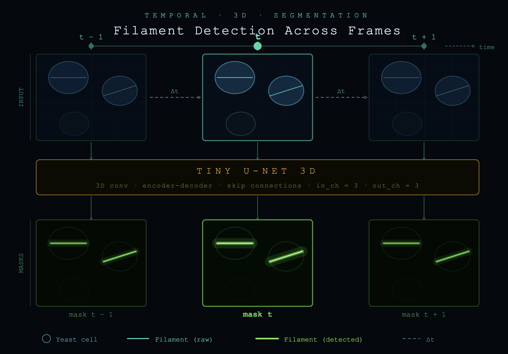

# Using a Tiny U Net 3D trained with temporal context to track a protein filaments in 3D.
You can train or ~2 hand labelled 3d videos and it will label ( even better than the original hand label) the tiff videos.
Note: I have broken the web labeller trying to sleekify it.



This repository now keeps one active workflow: the unified temporal-auto filament pipeline for 2D and 3D TIFF data.

## Active Entry Points

Use these scripts as the supported interface:

```bash
# Web UI for labeling, training, inference, and result viewing
uv run python scripts/filament_web.py

# Train temporal-auto models from TIFF files or directories
uv run python scripts/filament_train.py tifs2d tiffs3d --epochs 30

# Run inference + post-processing from TIFF files or directories
uv run python scripts/filament_infer.py tifs2d tiffs3d
```

Legacy command names are still present as thin wrappers:

- `uv run python scripts/filament_5z_painter_web.py`
- `uv run python scripts/filament_mask_web_viewer.py`
- `uv run python scripts/train_2d_temporal.py`
- `uv run python scripts/train_3d_temporal_auto.py`
- `uv run python scripts/batch_3d_tracker.py`

These wrappers forward into the unified pipeline and are kept only for compatibility.

## Active Repository Layout

- `scripts/`: active unified pipeline modules and compatibility wrappers
- `models/`: checkpoints and annotation store
- `results/masks`: filament mask TIFF outputs
- `results/cell_masks`: cell mask TIFF outputs
- `results/tracking_csvs`: tracking CSV outputs
- `tifs2d/`: 2D TIFF inputs
- `tiffs3d/`: 3D TIFF inputs
- `archive/`: historical scripts, logs, docs, and generated artifacts

## Notes

- The active pipeline auto-detects 2D vs 3D from TIFF shape.
- Existing checkpoints in `models/` are preserved.
- Historical scripts, preview media, notes, and logs were moved into `archive/` to keep the working tree clean.
